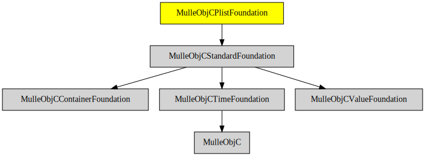

# MulleObjCPlistFoundation

#### 🏢 PropertyList parsing and printing

PropertyLists are a human readable representation of some data. The classic
Objective-C format is the [plist](//en.wikipedia.org/wiki/Property_list),
which looks like this:

```
{
	key = "string value";
}
```

This library supports "plist". Add [MulleObjCJSMNFoundation](//github.com/MulleWeb/MulleObjCJSMNFoundation) for JSON
or [MulleObjCExpatFoundation](//github.com/MulleFoundation/MulleObjCExpatFoundation) for XML.

Though the MulleObjCPlistFoundation is "below" MulleObjCOSFoundation, you
will likely need the MulleObjCOSFoundation for printing NSDates as it contains
the NSDateFormatter subclasses.


#### Classes

Class                         | Description
------------------------------|-----------------------
`NSPropertyListSerialization` |


### You are here




## Install

See [foundation-developer](//github.com//foundation-developer) for
installation instructions.

## License


## Author

[Nat!](//www.mulle-kybernetik.com/weblog) for
[Mulle kybernetiK](//www.mulle-kybernetik.com) and
[Codeon GmbH](//www.codeon.de)
[Christoper LLoyd](https://github.com/cjwl)
